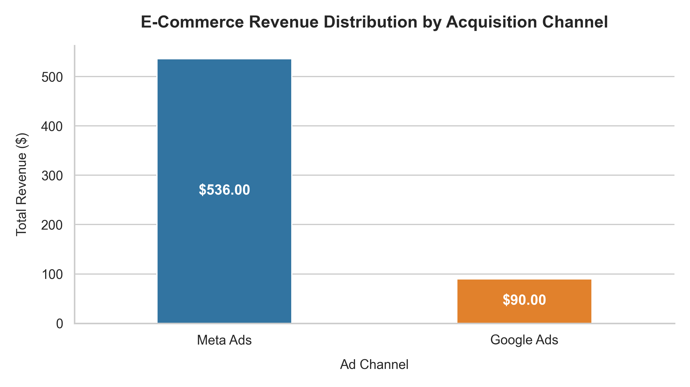

# E-Commerce Channel Performance & Data Hygiene Audit

A data quality audit and revenue attribution script designed to identify ingestion errors, handle null/refund anomalies, and calculate channel contribution metrics for marketing decision-makers.

---

## 📌 Executive Summary

Raw tracking exports frequently contain missing figures, dirty records, and negative adjustments (refunds) that distort true campaign ROAS and top-line figures. This pipeline audits transactional tables, applies data hygiene standards, and aggregates revenue and order share across acquisition channels.

---

## 🛠️ Data Hygiene Rules Applied

1. **Deduplication:** Strips duplicate transactional records while retaining valid sequential purchases.
2. **Refund Isolation:** Segregates negative balance records (`revenue <= 0`) to prevent skewing gross sales baselines.
3. **Null Imputation:** Imputes missing revenue records using median category baselines to preserve sample size without creating artificial outlier inflation.

---

## 📊 Commercial Insights Output

| Ad Channel     | Total Revenue ($) | Order Count | Revenue Share (%) |
| :------------- | :---------------- | :---------- | :---------------- |
| **Meta Ads**   | $536.00           | 4           | 85.62%            |
| **Google Ads** | $90.00            | 2           | 14.38%            |

- **Primary Driver:** Meta Ads accounts for over 85% of verified top-line revenue, indicating high campaign scale.
- **Diversification Need:** Search intent via Google Ads shows consistent conversion value but requires higher budget allocation to mitigate single-channel dependency.

---
---

## 🗄️ Relational SQL Customer LTV & Cohort Modeling
Using Common Table Expressions (CTEs) and window functions (`DENSE_RANK()`), transactional records were aggregated to calculate customer lifetime value (LTV), average order value (AOV), and retention behavior.

### SQL Output Table
| Customer | Total Orders | Total Spend ($) | Average Order Value ($) | Acquisition Channels | LTV Rank | Customer Segment |
| :--- | :--- | :--- | :--- | :--- | :--- | :--- |
| **Ali Khan** | 2 | $241.00 | $120.50 | Meta Ads | 1 | Repeat Buyer |
| **Hamza Rauf** | 1 | $210.00 | $210.00 | Meta Ads | 2 | One-Time Buyer |
| **Sara Ahmed** | 2 | $90.00 | $45.00 | Google Ads | 3 | Repeat Buyer |
| **Fatima Noor** | 1 | $85.00 | $85.00 | Meta Ads | 4 | One-Time Buyer |

### Key Strategic Findings
- **High-Value Acquisition:** Meta Ads acquired both the #1 repeat buyer (`$241.00`) and the highest single-purchase order (`$210.00`).
- **Retention Opportunity:** 50% of the customer base consists of repeat buyers, demonstrating positive cohort retention that warrants automated email/SMS remarketing flows.
## 💻 Tech Stack
- **Languages:** Python, SQL (SQLite)
- **Libraries:** Pandas, NumPy, Matplotlib, Seaborn
- **Environment:** VS Code, Git